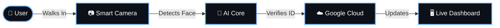

# FaceAttend

### _The Future of Workplace Presence_

 

## 🚀 Seamless. Secure. Smart.

  <b>FaceAttend</b> is not just software; it's a revolutionary leap in attendance automation. 
  By combining advanced Computer Vision with intuitive design, we turn checking in into a magical experience.

---

## 🔥 **Key Highlights**

|       ⚡ **Instant**       |  🧠 **Intelligent**   | ☁️ **Connected** |
| :------------------------: | :-------------------: | :--------------: |
| Recognized in Milliseconds | Smart Shift Detection | Live Cloud Sync  |

 

## 🔄 The Magic Workflow

 

## ✨ **Features at a Glance**

### 👁️ **Next-Gen Recognition**

Powered by state-of-the-art AI, **FaceAttend** identifies individuals instantly, even in challenging lighting conditions. No cards, no fingerprints—just you.

### 📊 **Real-Time Visualization**

Our **Live Sentinel Dashboard** provides a beautiful, real-time feed of attendance activities, giving you complete visibility and control.

### 🔄 **Zero-Touch Automation**

From **Shift Analysis** (Morning/Evening) to **Duration Tracking**, everything happens automatically. Walk in, and let the system handle the rest.

### 🌐 **Seamless Integration**

Your data, where you need it. Direct integration with **Google Ecosystems** ensures your records are always up-to-date and accessible from anywhere.

---

<b>📜 Legal & Licensing Agreements (Commercial Use)</b>

 

**1. Proprietary Nature**  
FaceAttend is a premium, proprietary software solution. By accessing or using this system, you acknowledge that all intellectual property rights, including but not limited to source code, AI models, and interface design, are the sole property of the developers.

**2. Paid Subscription & Licensing**  
Access to this repository is granted under a **Commercial Single-Entity License**. Continued use is subject to a valid, active subscription and verification of payment. Unauthorized use of this software without a confirmed license is strictly prohibited.

**3. Restrictions on Use**

- **No Redistribution:** You may not sub-license, rent, lease, or distribute the software to any third parties.
- **Internal Use Only:** License is limited to internal deployment within the purchasing organization.
- **Reverse Engineering:** Any attempt to reverse-engineer, decompile, or extract the AI model architecture and core methodology is a breach of contract.

**4. Warranty & Liability**  
The software is provided "As-Is." While we strive for 99.9% recognition accuracy, the developers are not liable for any data discrepancies or hardware-related failures occurring during operation.

**5. Compliance**  
Users are responsible for ensuring that facial data capture and storage comply with local data privacy regulations (GDPR, CCPA, etc.).

---

## 🛡️ **Enterprise Grade Security**

_Private. Secure. Reliable._

 

 

Designed & Developed by **GSSV**

**© 2026 FaceAttend. All Rights Reserved.**
_Internal Distribution Only_

